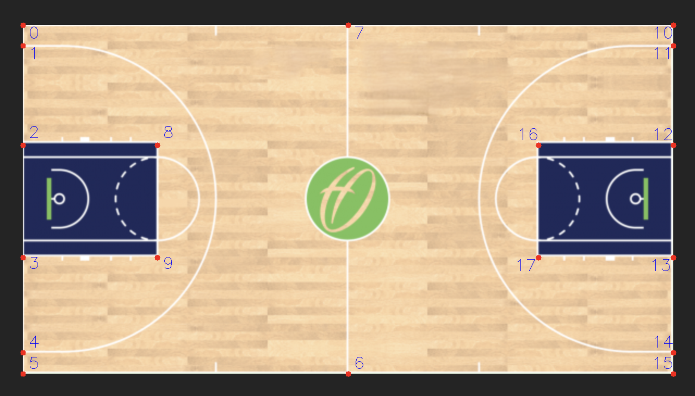
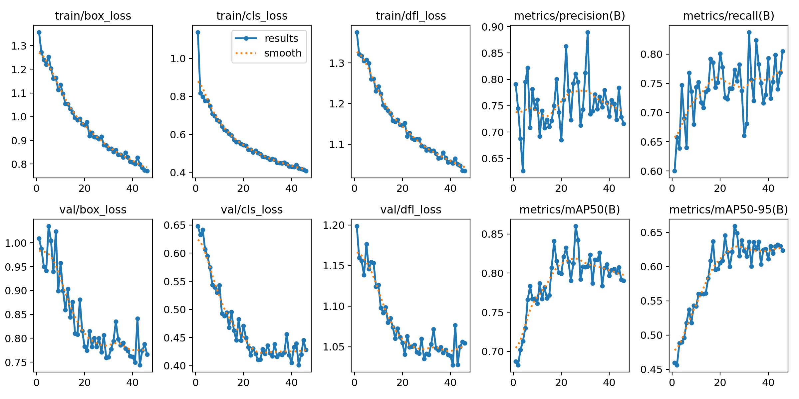

# Basketball Tracker CV 🏀

Un sistema avanzato di computer vision per il tracciamento e l'analisi di partite di basket in tempo reale, con visualizzazione tattica.

[English version below](#english-version)

## 📋 Indice
- [Caratteristiche](#caratteristiche)
- [Requisiti](#requisiti)
- [Installazione](#installazione)
- [Utilizzo](#utilizzo)
- [Struttura del Progetto](#struttura-del-progetto)
- [Modelli](#modelli)
- [Output](#output)
- [Risoluzione Problemi](#risoluzione-problemi)
- [Licenza](#licenza)

## ✨ Caratteristiche

- **Rilevamento Giocatori e Pallone**: Utilizza modelli YOLO11 o RF-DETR per il rilevamento accurato di giocatori e pallone
- **Tracciamento Multi-Oggetto**: Implementa ByteTrack per tracciare i giocatori attraverso i frame anche con occlusioni
- **Rilevamento Keypoint del Campo**: Identifica automaticamente i punti chiave del campo da basket (linee, canestri, etc.)
- **Vista Tattica**: Trasforma le posizioni dei giocatori in una vista tattica 2D del campo
- **Interpolazione Intelligente**: Riempie automaticamente i dati mancanti per posizioni di giocatori e pallone
- **Calcolo del Possesso**: Determina quale giocatore ha il possesso del pallone
- **Video Annotato**: Genera video di output con overlay delle rilevazioni e vista tattica

## 🔧 Requisiti

### Software
- Python 3.8+
- CUDA (opzionale, per accelerazione GPU)


## 📦 Installazione

1. **Clonare il repository**
```bash
git clone https://github.com/pgnsamu/basketballTrackerCV.git
cd basketballTrackerCV
```

2. **Creare un ambiente virtuale** (consigliato)
```bash
python -m venv venv
source venv/bin/activate  # Su Windows: venv\Scripts\activate
```

3. **Installare le dipendenze**
```bash
pip install -r requirements.txt
```

4. **Scaricare i modelli pre-addestrati**

Devi avere due modelli:
- Modello per il rilevamento dei keypoint del campo (es. `models/BEST2.pt`)
- Modello per il rilevamento di giocatori e pallone (es. `models/PlayerDet.pt`)

Posiziona i modelli nella cartella `models/`.

## 🚀 Utilizzo

### Comando Base
```bash
python main.py --keypoint-model models/BEST2.pt --player-model models/PlayerDet.pt
```

### Parametri Disponibili

#### Video Input/Output
- `--video`: Path del video da processare (default: `input_video/video_1.mp4`)
- `--output-path`: Path del video di output (default: `outputVideo/output_video.mp4`)
- `--fps`: FPS del video di output (default: `30.0`)

#### Modelli
- `--keypoint-model`: Path del modello per rilevamento keypoints (richiesto)
- `--player-model`: Path del modello per rilevamento giocatori (richiesto)

#### Stub (Cache)
##### In qualunque caso ai path degli stubs viene concatenato alla fine il nome del video processato, per permettere di avere stubs separati per video diversi
- `--keypoint-stub`: Path dello stub per keypoints (default: `stubs/court_key_points_stub.pkl`)
- `--player-stub`: Path dello stub per posizioni giocatori (default: `stubs/players_positions_stub.pkl`)
- `--no-stub`: Disabilita lettura da stub e ricalcola tutto

#### Altri
- `--court-image`: Path immagine campo tattico (default: `images/basketball_court.png`)
- `--debug`: Abilita modalità debug per visualizzazione numero frame e salvataggio keypoints rilevati in un file di testo

### Esempi

**Elaborare un video specifico:**
```bash
python main.py \
  --video input_video/game1.mp4 \
  --output-path outputVideo/game1_analyzed.mp4 \
  --keypoint-model models/BEST2.pt \
  --player-model models/PlayerDet.pt
```

**Modalità debug (visualizza i frame durante l'elaborazione):**
```bash
python main.py \
  --video video_1.mp4 \
  --keypoint-model models/BEST2.pt \
  --player-model models/PlayerDet.pt \
  --debug
```

**Ricalcolare tutto senza usare la cache:**
```bash
python main.py \
  --video video_1.mp4 \
  --keypoint-model models/BEST2.pt \
  --player-model models/PlayerDet.pt \
  --no-stub
```

## 📁 Struttura del Progetto

```
basketballTrackerCV/
├── main.py                          # Entry point principale
├── requirements.txt                 # Dipendenze Python
├── README.md                        # Questo file
│
├── detectors/                       # Moduli di rilevamento
│   ├── keypoint_detector.py        # Rilevamento keypoint del campo
│   ├── player_ball_detector.py     # Rilevamento giocatori e pallone
│   └── player_tracker.py           # Tracciamento e interpolazione
│
├── homography/                      # Trasformazione prospettica
│   └── homography.py               # Calcolo omografia
│
├── tactical_view_converter/        # Vista tattica
│   └── tactical_view_converter.py  # Conversione coordinate a vista tattica
│
├── drawers/                         # Rendering e visualizzazione
│   ├── drawWindow.py               # Gestione finestra output
│   └── drawPoint.py                # Rendering elementi grafici
│
├── utils/                           # Utility varie
│   ├── video_utils.py              # Lettura/scrittura video
│   ├── detectedObject.py           # Classi oggetti rilevati
│   ├── bbox_utils.py               # Utilità bounding box
│   ├── stubs_utils.py              # Gestione cache
│   └── overlay.py                  # Overlay grafici
│
├── models/                          # Modelli di ML (non inclusi nel repo)
│   ├── BEST2.pt                    # Modello keypoint
│   └── PlayerDet.pt                # Modello giocatori/pallone
│
├── images/                          # Immagini risorse
│   └── basketball_court.png        # Immagine campo tattico
│
├── input_video/                     # Video di input
├── outputVideo/                     # Video elaborati
└── stubs/                           # File cache (generati automaticamente)
```

## 🤖 Modelli

Il progetto utilizza due modelli di deep learning:

### 1. Modello Keypoint del Campo
- **Tipo**: YOLO per keypoint detection
- **Scopo**: Rileva 18 keypoint del campo da basket
- **Keypoint rilevati**:
  - [0] Angolo alto (lato sinistro)
  - [1] Linea dei 3 punti dall'alto (lato sinistro)
  - [2] Angolo sinistro alto dell'area per il tiro libero (lato sinistro)
  - [3] Angolo sinistro basso dell'area per il tiro libero (lato sinistro)
  - [4] Linea dei 3 punti dal basso (lato sinistro)
  - [5] Angolo basso (lato sinistro)
  - [8] Angolo destro alto dell'area per il tiro libero (lato sinistro)
  - [9] Angolo destro basso dell'area per il tiro libero (lato sinistro)
  ---
  - [6] Linea di metà campo punto alto
  - [7] Linea di metà campo punto basso
  ---
  - [10] Angolo alto (lato destro)
  - [11] Linea dei 3 punti dall'alto (lato destro)
  - [12] Angolo destro alto dell'area per il tiro libero (lato destro)
  - [13] Angolo destro basso dell'area per il tiro libero (lato destro)
  - [14] Linea dei 3 punti dal basso (lato destro)
  - [15] Angolo basso (lato destro)
  - [16] Angolo sinistro alto dell'area per il tiro libero (lato destro)
  - [17] Angolo sinistro basso dell'area per il tiro libero (lato destro)

  

  #### Metriche del Modello per il rilevamento del campo durante l'addestramento:
  .png)

  

### 2. Modello Giocatori e Pallone
- **Tipo**: YOLO11 o RF-DETR
- **Classi rilevate**:
  - Classe 0/1: Pallone
  - Classe 3/4: Giocatore
- **Features**:
  - Tracciamento multi-oggetto con ByteTrack
  - Rilevamento del possesso palla
  - Smoothing EMA per posizione pallone

  #### Metriche del Modello per il rilevamento di giocatori e pallone durante l'addestramento:
  


## 📊 Output

Il sistema genera:

1. **Video Annotato**: Video con overlay che include:
   - Bounding box dei giocatori
   - Posizione del pallone
   - Keypoint del campo visualizzati
   - Vista tattica sovrapposta
   - Indicatore possesso palla

2. **File Stub**: Cache dei risultati per elaborazioni successive più veloci
   - `court_key_points_stub.pkl`: Keypoint del campo per frame
   - `players_positions_stub.pkl`: Posizioni giocatori per frame
   - `balls_positions_stub.pkl`: Posizioni pallone per frame

3. **File Debug** (modalità `--debug`):
   - `court_keypoints.txt`: Log dei keypoint rilevati

## 🔍 Pipeline di Elaborazione

1. **Caricamento Video**: Lettura dei frame dal video di input
2. **Rilevamento Keypoint**: Identificazione punti chiave del campo
3. **Rilevamento Oggetti**: Detection di giocatori e pallone
4. **Tracciamento**: Assegnazione ID consistenti ai giocatori
5. **Interpolazione**: Riempimento posizioni mancanti
6. **Validazione**: Controllo coerenza keypoint rilevati
7. **Trasformazione**: Conversione a coordinate vista tattica
8. **Rendering**: Generazione video finale con annotazioni

## Validazione dei Keypoint Rilevati
il processo di validazione è stato implementato in maniera try and error testando su diverse combinazioni di video, cercando di rifinire il risultato finale.

#### Algoritmo finale di validazione:
```Pseudo-code
Per ogni frame:
  Se non è il primo frame:
    Controllo se c'è sovrapposizione con keypoint equivalenti degli ultimi 10 frame
    Se c'è sovrapposizione:
      Uso quelli già rilevati negli ultimi frame
    Rimuovo i keypoint uguali
  Per ogni keypoint rilevato:
    Calcolo se sta nella parte del campo opportuna
    Se non sta nella parte del campo opportuna:
      Inverto con il suo equivalente
    Trovo 2 keypoint di riferimento e calcolo la proporzione tra le distanze
    Se la proporzione non è coerente con quella reale:
      Scarto il keypoint
    Controllo se c'è sovrapposizione con keypoint equivalenti nello stesso frame
    Se c'è sovrapposizione:
      Scarto il keypoint non coerente con il lato del campo inquadrato
  ritorno i keypoint validati
```
## 🐛 Risoluzione Problemi

### Errore: "OMP: Error #15"
Questo errore è già gestito nel codice. Se persiste:
```bash
export KMP_DUPLICATE_LIB_OK=TRUE  # Linux/Mac
set KMP_DUPLICATE_LIB_OK=TRUE     # Windows
```

### Performance lente
- Assicurati di avere CUDA installato per usare la GPU
- Usa file stub per evitare di rielaborare video già processati
- Riduci la risoluzione del video di input

### Keypoint non rilevati correttamente
- Verifica che il modello keypoint sia addestrato sui dati corretti
- Controlla l'illuminazione e la qualità del video
- Aumenta il `conf_threshold` nel CourtKeypointDetector

### Giocatori non tracciati
- Verifica le soglie di confidenza in `player_ball_detector.py`
- Controlla la dimensione di inferenza (attualmente 1280px)
- Verifica che il modello sia compatibile con la risoluzione del video

## 📄 Licenza

La licenza per questo progetto non è ancora stata specificata.

Dataset di training giocatori e palla: [basketball-player-detection-3](https://universe.roboflow.com/projects-wh5rm/basketball-player-detection-3-ycjdo-cffrq)

Dataset di training keypoint del campo: [reloc2-den7l](https://universe.roboflow.com/fyp-3bwmg/reloc2-den7l)

---

## English Version

# Basketball Tracker CV 🏀

An advanced computer vision system for real-time basketball game tracking and analysis with tactical visualization.

## 📋 Table of Contents
- [Features](#features-1)
- [Requirements](#requirements-1)
- [Installation](#installation-1)
- [Usage](#usage-1)
- [Project Structure](#project-structure-1)
- [Models](#models-1)
- [Output](#output-1)
- [Troubleshooting](#troubleshooting-1)
- [License](#license-1)

## ✨ Features

- **Player and Ball Detection**: Uses YOLO11 or RF-DETR models for accurate player and ball detection
- **Multi-Object Tracking**: Implements ByteTrack to track players across frames even with occlusions
- **Court Keypoint Detection**: Automatically identifies basketball court keypoints (lines, hoops, etc.)
- **Tactical View**: Transforms player positions into a 2D tactical court view
- **Smart Interpolation**: Automatically fills missing data for player and ball positions
- **Possession Calculation**: Determines which player has ball possession
- **Annotated Video**: Generates output video with detection overlays and tactical view

## 🔧 Requirements

### Software
- Python 3.8+
- CUDA (optional, for GPU acceleration)


## 📦 Installation

1. **Clone the repository**
```bash
git clone https://github.com/pgnsamu/basketballTrackerCV.git
cd basketballTrackerCV
```

2. **Create a virtual environment** (recommended)
```bash
python -m venv venv
source venv/bin/activate  # On Windows: venv\Scripts\activate
```

3. **Install dependencies**
```bash
pip install -r requirements.txt
```

4. **Download pre-trained models**

You need two models:
- Court keypoint detection model (e.g., `models/BEST2.pt`)
- Player and ball detection model (e.g., `models/PlayerDet.pt`)

Place the models in the `models/` folder.

## 🚀 Usage

### Basic Command
```bash
python main.py --keypoint-model models/BEST2.pt --player-model models/PlayerDet.pt
```

### Available Parameters

#### Video Input/Output
- `--video`: Path to video to process (default: `input_video/video_1.mp4`)
- `--output-path`: Output video path (default: `outputVideo/output_video.mp4`)
- `--fps`: Output video FPS (default: `30.0`)

#### Models
- `--keypoint-model`: Keypoint detection model path (required)
- `--player-model`: Player detection model path (required)

#### Stub (Cache)
##### In any case, the video name is appended to the end of the stub paths to allow separate stubs for different videos
- `--keypoint-stub`: Keypoint stub path (default: `stubs/court_key_points_stub.pkl`)
- `--player-stub`: Player positions stub path (default: `stubs/players_positions_stub.pkl`)
- `--no-stub`: Disable stub reading and recalculate everything

#### Other
- `--court-image`: Tactical court image path (default: `images/basketball_court.png`)
- `--debug`: Enable debug mode with frame visualization and saving detected keypoints to a text file

### Examples

**Process a specific video:**
```bash
python main.py \
  --video input_video/game1.mp4 \
  --output-path outputVideo/game1_analyzed.mp4 \
  --keypoint-model models/BEST2.pt \
  --player-model models/PlayerDet.pt
```

**Debug mode (displays frames during processing):**
```bash
python main.py \
  --video video_1.mp4 \
  --keypoint-model models/BEST2.pt \
  --player-model models/PlayerDet.pt \
  --debug
```

**Recalculate everything without using cache:**
```bash
python main.py \
  --video video_1.mp4 \
  --keypoint-model models/BEST2.pt \
  --player-model models/PlayerDet.pt \
  --no-stub
```

## 📁 Project Structure

```
basketballTrackerCV/
├── main.py                          # Main entry point
├── requirements.txt                 # Python dependencies
├── README.md                        # This file
│
├── detectors/                       # Detection modules
│   ├── keypoint_detector.py        # Court keypoint detection
│   ├── player_ball_detector.py     # Player and ball detection
│   └── player_tracker.py           # Tracking and interpolation
│
├── homography/                      # Perspective transformation
│   └── homography.py               # Homography calculation
│
├── tactical_view_converter/        # Tactical view
│   └── tactical_view_converter.py  # Coordinate conversion to tactical view
│
├── drawers/                         # Rendering and visualization
│   ├── drawWindow.py               # Output window management
│   └── drawPoint.py                # Graphic elements rendering
│
├── utils/                           # Various utilities
│   ├── video_utils.py              # Video read/write
│   ├── detectedObject.py           # Detected object classes
│   ├── bbox_utils.py               # Bounding box utilities
│   ├── stubs_utils.py              # Cache management
│   └── overlay.py                  # Graphic overlays
│
├── models/                          # ML models (not included in repo)
│   ├── BEST2.pt                    # Keypoint model
│   └── PlayerDet.pt                # Player/ball model
│
├── images/                          # Resource images
│   └── basketball_court.png        # Tactical court image
│
├── input_video/                     # Input videos
├── outputVideo/                     # Processed videos
└── stubs/                           # Cache files (auto-generated)
```

## 🤖 Models

The project uses two deep learning models:

### 1. Court Keypoint Model
- **Type**: YOLO for keypoint detection
- **Purpose**: Detects 18 basketball court keypoints
- **Detected keypoints**:
  - **Keypoint rilevati**:
  - [0] Top left corner (lato sinistro)
  - [1] Top 3-point line (lato sinistro)
  - [2] Top left corner of free throw area (lato sinistro)
  - [3] Bottom left corner of free throw area (lato sinistro)
  - [4] Bottom 3-point line (lato sinistro)
  - [5] Bottom left corner (lato sinistro)
  - [8] Top right corner of free throw area (lato sinistro)
  - [9] Bottom right corner of free throw area (lato sinistro)
  ---
  - [6] Top half-court line
  - [7] Bottom half-court line
  ---
  - [10] Top right corner (lato destro)
  - [11] Top 3-point line (lato destro)
  - [12] Top right corner of free throw area (lato destro)
  - [13] Bottom right corner of free throw area (lato destro)
  - [14] Bottom 3-point line (lato destro)
  - [15] Bottom right corner (lato destro)
  - [16] Top left corner of free throw area (lato destro)
  - [17] Bottom left corner of free throw area (lato destro)

  

  #### Court Keypoint Model metrics during training:
  .png)

### 2. Player and Ball Model
- **Type**: YOLO11 or RF-DETR
- **Detected classes**:
  - Class 0/1: Ball
  - Class 3/4: Player
- **Features**:
  - Multi-object tracking with ByteTrack
  - Ball possession detection
  - EMA smoothing for ball position

  #### Player and Ball Model metrics during training:
  


## 📊 Output

The system generates:

1. **Annotated Video**: Video with overlays including:
   - Player bounding boxes
   - Ball position
   - Visualized court keypoints
   - Overlaid tactical view
   - Ball possession indicator

2. **Stub Files**: Cached results for faster subsequent processing
   - `court_key_points_stub.pkl`: Court keypoints per frame
   - `players_positions_stub.pkl`: Player positions per frame
   - `balls_positions_stub.pkl`: Ball positions per frame

3. **Debug Files** (`--debug` mode):
   - `court_keypoints.txt`: Log of detected keypoints

## 🔍 Processing Pipeline

1. **Video Loading**: Read frames from input video
2. **Keypoint Detection**: Identify court keypoints
3. **Object Detection**: Detect players and ball
4. **Tracking**: Assign consistent IDs to players
5. **Interpolation**: Fill missing positions
6. **Validation**: Check consistency of detected keypoints
7. **Transformation**: Convert to tactical view coordinates
8. **Rendering**: Generate final video with annotations

## Validation of Detected Keypoints
The validation process has been implemente in a try and error way testing on different combinations of videos, trying to refine the final result.

#### Pseudo-code for final validation:
```Pseudo-code
For each frame:
  If it is not the first frame:
    Check for overlap with equivalent keypoints from the last 10 frames
    If there is overlap:
      Use the keypoints already detected in the previous frames
    Remove duplicate keypoints
  For each detected keypoint:
    Calculate if it is in the correct part of the court
    If it is not in the correct part of the court:
      Swap it with its equivalent
    Find 2 reference keypoints and calculate the proportion between the distances
    If the proportion is not consistent with the real one:
      Discard the keypoint
    Check for overlap with equivalent keypoints in the same frame
    If there is overlap:
      Discard the keypoint that is not consistent with the side of the court being framed
  Return the validated keypoints
```

## 🐛 Troubleshooting

### Error: "OMP: Error #15"
This error is already handled in the code. If it persists:
```bash
export KMP_DUPLICATE_LIB_OK=TRUE  # Linux/Mac
set KMP_DUPLICATE_LIB_OK=TRUE     # Windows
```

### Slow performance
- Make sure CUDA is installed to use GPU
- Use stub files to avoid reprocessing already processed videos
- Reduce input video resolution

### Keypoints not detected correctly
- Verify the keypoint model is trained on correct data
- Check lighting and video quality
- Increase `conf_threshold` in CourtKeypointDetector

### Players not tracked
- Check confidence thresholds in `player_ball_detector.py`
- Check inference size (currently 1280px)
- Verify model is compatible with video resolution

## 📄 License

The license for this project has not yet been specified.

Training dataset: [basketball-player-detection-3](https://universe.roboflow.com/projects-wh5rm/basketball-player-detection-3-ycjdo-cffrq) 

Dataset for court keypoints: [reloc2-den7l](https://universe.roboflow.com/fyp-3bwmg/reloc2-den7l)

---

## 👥 Authors

- [@pgnsamu](https://github.com/pgnsamu)
- [@AlessioCesarini](https://github.com/AlessioCesarini)

## 🙏 Acknowledgments

- YOLO by Ultralytics
- RF-DETR detection framework
- Supervision library for tracking
- Roboflow for the training dataset
